# Flying Car: 3D Estimation

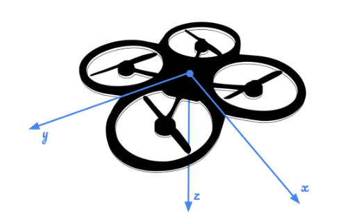

## Overview

The 3D Estimation project is the fourth project in the Udacity Flying Car Nanodegree. In this project, our goal was to implement an estimator using an Extended Kalman Filter (EKF) to fuse multiple sources of sensor data (GPS, magnetometer, IMU) from a simulated quadrotor to estimate the vehicle's state in 3 dimensions.

The following sensors will be used:
* GPS: 3D position, 3D velocity
* IMU (accelerometer and gyroscope): 3D acceleration, angular rotation rates
* Magnetometer: heading (yaw angle)

The Extended Kalman Filter will be supplemented by a complementary filter that will be used to track the Roll and Pitch angles.

The framework, mathematical formulas and pseudocode for the EKF and Complementary Filter implementation are largely based on the paper <i>Estimation for Quadrotors</i>, by Stephanie Tellex, Andy Brown and Sergei Lupashin, cited as ref [1]. The starter code in this repository was forked from the upstream repository(https://github.com/udacity/FCND-Estimation-Cpp) which is credited to Sergei Lupashin and Fotokite. 

_Note: The image above was provided by the course_

<br/>

## Project Setup

In order to get this project to run on your machine, follow the Setup section in the original [README](./README_FromParentRepo.md) from the [parent repo](https://github.com/udacity/FCND-Estimation-CPP). 

<br/>

## Project Details

### Implement Estimator

#### 1. Determine the standard deviation of the measurement noise of both GPS X data and Accelerometer X data.

In this step, we run the Sensor Noise scenario so that we can collect data on the GPS and IMUs Accelerometer. Then, we determine the standard deviation. 

The collected GPS.X data was logged to the ./config/Graph1.txt file. A sample of the data logged follows:

```
time, Quad.GPS.X
0.105000,-0.372319
0.205000,0.639987
0.305000,-0.736634
0.404998,0.869336
0.504997,0.180194
0.604996,-0.945330
0.704994,0.887752
0.804993,-0.259940
```

The collected IMU.Accel.X data was logged to the ./config/Graph2.txt file. A sample of the data follows:

```
time, Quad.IMU.AX
0.005000,0.552092
0.010000,0.073913
0.015000,0.523375
0.020000,-0.426419
0.025000,0.916424
0.030000,-0.296237
0.035000,0.182526
0.040000,-0.569616
```

To get the standard deviation for both sensors, I pasted the data into an Excel spreadsheet and used a formula to estimate the standard deviation.

The resulting settings for MeasuredStdDev_GPSPosXY and MeasuredStdDev_AccelXY were made in the 06_SensorNoise.txt file. For the results of this test, refer to `Flight Evaluation: Step 1. Sensor Noise` later in this writeup.

#### 2. Implement a better rate gyro attitude integration scheme in the `UpdateFromIMU()` function.

I used the `Quaternion` class and `IntegrateBodyRate()` method to integrate the body rates. Then, I converted back to Euler angles using `estAttitude.ToEulerRPY()`.

```c++
Quaternion<float> estAttitude = Quaternion<float>::FromEuler123_RPY(rollEst, pitchEst, ekfState(6));
estAttitude.IntegrateBodyRate(V3D(gyro), dtIMU);

V3F predictedAttitude = V3F(estAttitude.ToEulerRPY());
predictedRoll = predictedAttitude.x;
predictedPitch = predictedAttitude.y;
ekfState(6) = predictedAttitude.z;

// normalize yaw to [-pi, pi]
if (ekfState(6) > F_PI) ekfState(6) -= 2.f*F_PI;
if (ekfState(6) < -F_PI) ekfState(6) += 2.f*F_PI;
```

#### 3. Implement all of the elements of the prediction step for the estimator.

The overall process for implementing this step is as follows:
* Implement `PredictState()`
* Implement `GetRbgPrime()`
* Implement `Predict()`

Next, I will explain the implementation of each method above.


##### Implement `PredictState()`

In order to perform state transition the current state must be predicted forward in time according to the following formula defined as Equation 49 in Tellex [1]:

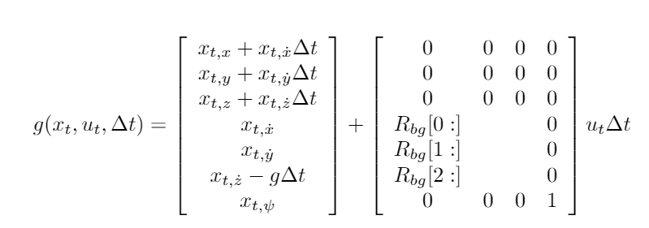

In order to rotate from the body frame to the global frame (and avoid needing to use a rotation matrix as in the equation), I made use of the provided attitude Quaternion's `Rotate_BtoI()` method.

```c++
V3F globalFrameAccel = attitude.Rotate_BtoI(accel);
predictedState(0) = predictedState[0] + predictedState[3] * dt;
predictedState(1) = predictedState[1] + predictedState[4] * dt;
predictedState(2) = predictedState[2] + predictedState[5] * dt;
predictedState(3) = predictedState[3] + globalFrameAccel.x * dt;
predictedState(4) = predictedState[4] + globalFrameAccel.y * dt;
predictedState(5) = predictedState[5] + (globalFrameAccel.z - (float)CONST_GRAVITY) * dt;
```

##### Implement `GetRbgPrime()`

RbgPrime is the partial derivative of the R_bg rotation matrix with respect to yaw. The Rbg Prime matrix formula is defined as Equation 52 in Tellex et al. [1]:

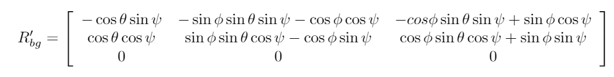

Since the provided code already set all of the RbgPrime Matrix's values to zero, I just filled in the non-zero values.

```c++
float phi = roll;
float theta = pitch;
float psi = yaw;

RbgPrime(0, 0) = -cos(theta) * sin(psi);
RbgPrime(0, 1) = -sin(phi) * sin(theta) * sin(psi) - cos(phi) * cos(psi);
RbgPrime(0, 2) = -cos(phi) * sin(theta) * sin(psi) + sin(phi) * cos(psi);
RbgPrime(1, 0) = cos(theta) * cos(psi);
RbgPrime(1, 1) = sin(phi) * sin(theta) * cos(psi) - cos(phi) * sin(psi);
RbgPrime(1, 2) = cos(phi) * sin(theta) * cos(psi) + sin(phi) * sin(psi);
```

##### Implement `Predict()`

Finally, to get the prediction, there are 2 steps:
* Take the Jacobian to get g'
* Then solve for ekfCov

For the jacobian, the formula is defined as Equations 50, 51 in Tellex et al. [1]:

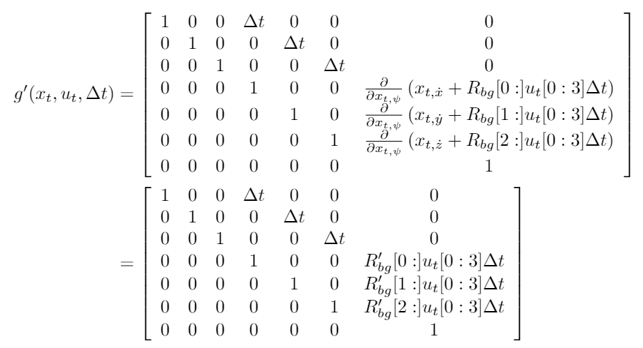

Since gPrime was already set to the identity matrix, I just had to set the delta_t values and fill in for the matrix multiplications involving RbgPrime, the commanded accelerations and delta_t. 
<br/>

<i>Note: the quad's actual accelerations as measured by the accelerometer's specific acceleration (adjusted for gravity to derive actual accelerations) were used as a proxy for the control inputs (u_t).</i>

```c++
// set all delta_t values
gPrime(0, 3) = gPrime(1, 4) = gPrime(2, 5) = dt;

// u_t (control input)
VectorXf ut(3);
ut(0) = accel.x;
ut(1) = accel.y;
ut(2) = accel.z - (float)CONST_GRAVITY;

gPrime(3, 6) = RbgPrime.row(0).dot(ut * dt);
gPrime(4, 6) = RbgPrime.row(1).dot(ut * dt);
gPrime(5, 6) = RbgPrime.row(2).dot(ut * dt);
```

Then, solve for ekfCov:

```
ekfCov = gPrime * (ekfCov * gPrime.transpose()) + Q;
```

#### 4. Implement the magnetometer update.

First, set the hPrime matrix. It has previously been initialized to all zeros, so just add in the 1 at the end.

```c++
//h` = [0 0 0 0 0 0 1]
hPrime(0, 6) = 1;
```

Then, set Yaw to the ekfState variable, then normalize.

```c++
zFromX(0) = ekfState(6);
float magDiff = magYaw - zFromX(0);
if (magDiff > F_PI) zFromX(0) += 2.f*F_PI;
if (magDiff < -F_PI) zFromX(0) -= 2.f*F_PI;
```	


#### 5. Implement the GPS update.

First, set the hPrime to be the identity matrix.

```c++
hPrime.setIdentity();
```

Then, update the state data in zFromX with the values in the current ekfState.

```c++
for (int i = 0; i < 6; ++i)
	zFromX(i) = ekfState(i);
```

<br/>

### Flight Evaluation

#### 1. Meet the performance criteria of each step.

For each step of the project, the final estimator should be able to successfully meet the performance criteria with the controller provided. The estimator's parameters should be properly adjusted to satisfy each of the performance criteria elements.

The steps included:
* Step 1: Sensor Noise 
* Step 2: Attitude Estimation
* Step 3: Prediction Step
* Step 4: Magnetometer Update
* Step 5: Closed Loop + GPS Update
* Step 6: Adding Your Controller

<br/>

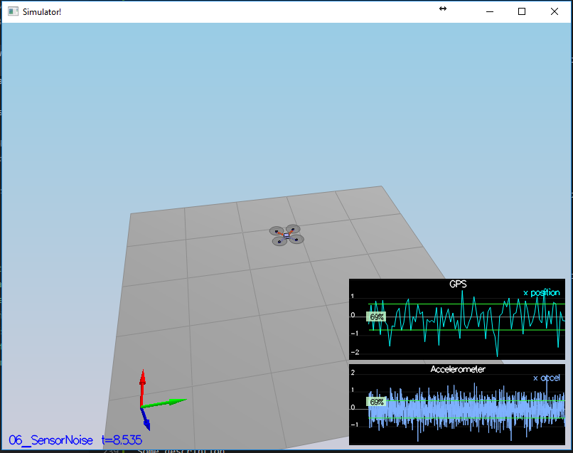

##### Step 1. Sensor Noise

In this step, we needed to collect data regarding sensor noise in the GPS' x measurement and the IMUs accel.x measurement. Then, we input the standard deviation of the sensor noise for the GPS and IMU. If this was input correctly, then the scenario passed as shown in the simulator output:

```
Simulation #2 (../config/06_SensorNoise.txt)
PASS: ABS(Quad.GPS.X-Quad.Pos.X) was less than MeasuredStdDev_GPSPosXY for 69% of the time
PASS: ABS(Quad.IMU.AX-0.000000) was less than MeasuredStdDev_AccelXY for 69% of the time
```

<br/>

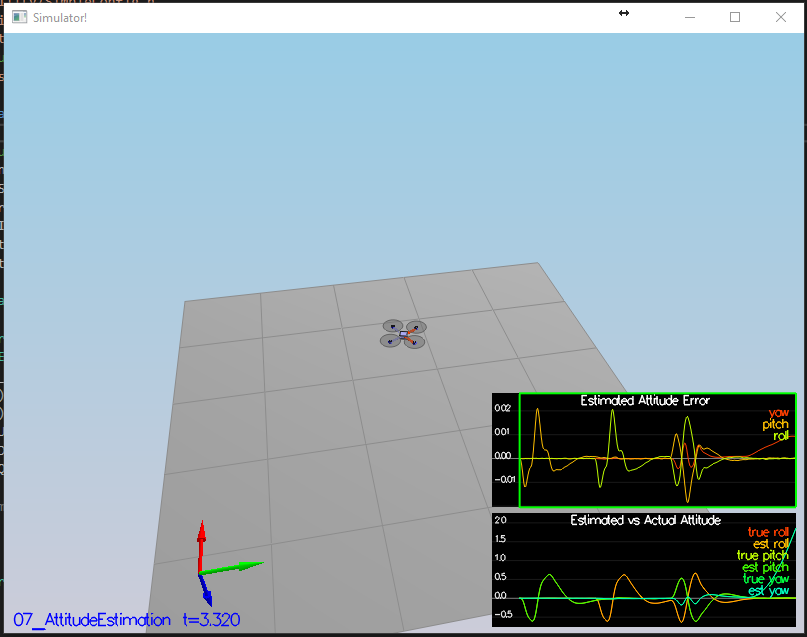

##### Step 2. Attitude Estimation

In this step, we will be improving the provided complementary filter for attitude estimation. Upon completion, I recieved the following feedback for the scenario:

```
Simulation #2 (../config/07_AttitudeEstimation.txt)
PASS: ABS(Quad.Est.E.MaxEuler) was less than 0.100000 for at least 3.000000 seconds
```

##### Step 3. Prediction Step

In this step, we will be implementing the prediction step of the EKF. There are no quantitative success criteria for this step, this is more of a qualitative check that our code is correct based on the shape of the graphs once we have completed this objective. See graph images for each part below.

---

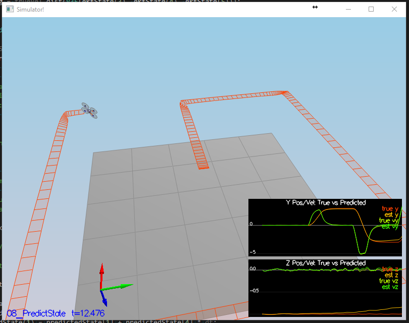
Step 3, Part 1: Predict State Screenshot

<br/>

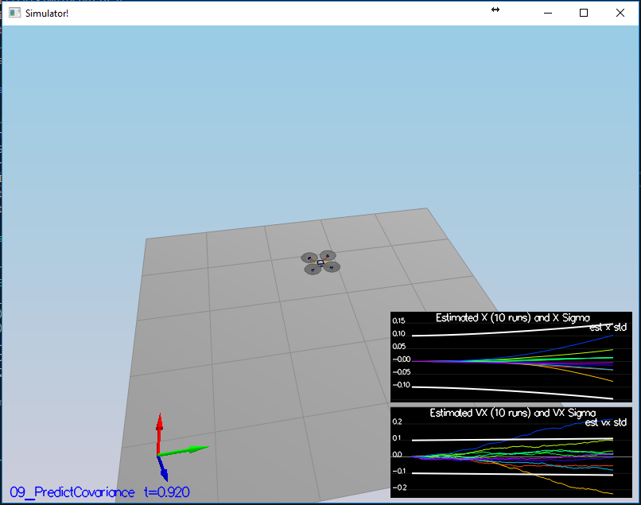
Step 3, Part 2: Predict Covariance Screenshot

<br/>

---

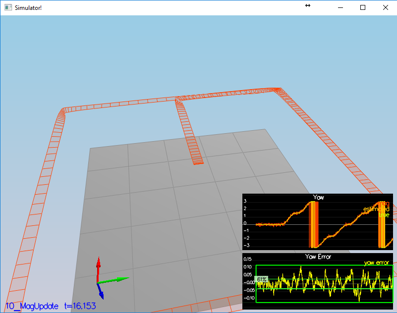
##### Step 4. Magnetometer Update

In this step, we implement the magnetometer sensor update within the EKF's measurement model to improve the performance of estimating the vehicle's heading.

Upon completion, I recieved the following feedback:

```
Simulation #27 (../config/10_MagUpdate.txt)
PASS: ABS(Quad.Est.E.Yaw) was less than 0.120000 for at least 10.000000 seconds
PASS: ABS(Quad.Est.E.Yaw-0.000000) was less than Quad.Est.S.Yaw for 63% of the time
```

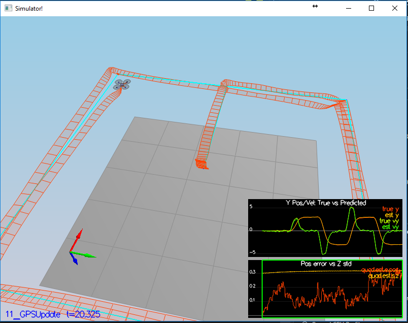
##### Step 5. Closed Loop + GPS Update

In this step, we implement the GPS sensor update within the EKF's measurement model to improve the performance of estimating the vehicle's 3D position and 3D velocity.

Upon completion, I received the following feedback for the scenario:

```
Simulation #6 (../config/11_GPSUpdate.txt)
PASS: ABS(Quad.Est.E.Pos) was less than 1.000000 for at least 20.000000 seconds
```

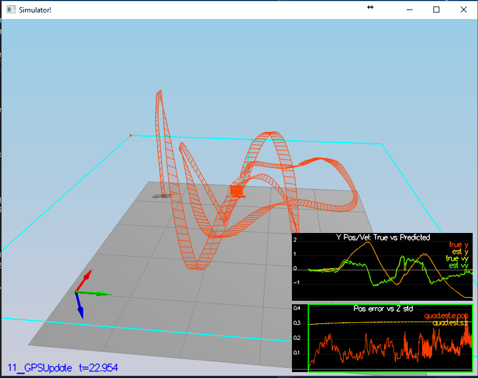
##### Step 6. Adding Your Controller

Finally, I added my controller from the 3D Controls project and integrated it into the code. Initially, the quadrotor flew a pretty crazy trajectory (see screenshot above). Then, I began the work to detune the parameters.

Proceed to the next section for the results.

<br/>

#### 2. De-tune your controller to successfully fly the final desired box trajectory with your estimator and realistic sensors.

This task required that we detune our flight controller from the previous project to achieve a stable flight.

First, we had to make our controller not use ideal estimator by changing the setting in the QuadControlParams.txt:

```
UseIdealEstimator=0
```

I ran several iterations and observed the flight paths to select the best one. All of the  flights depicted in the following screenshots resulted in a "PASS" output. However, I wanted to further explore the effect of changing different parameters on the resulting trajectory to see how much the end result could be improved.

<br/>

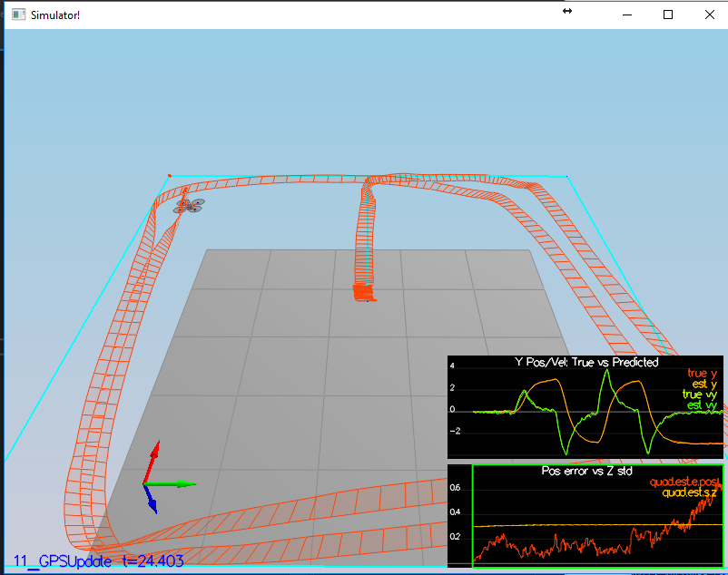
<br/>Flight Test V1

<br/>

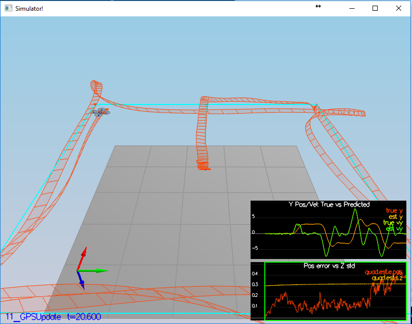
<br/>Flight Test V2

<br/>

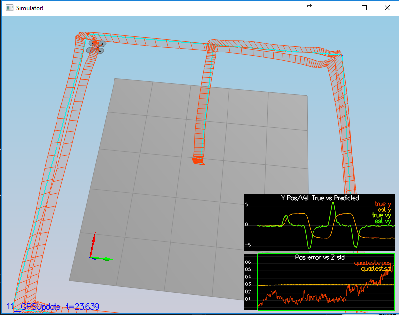
<br/>Flight Test V3

<br/>

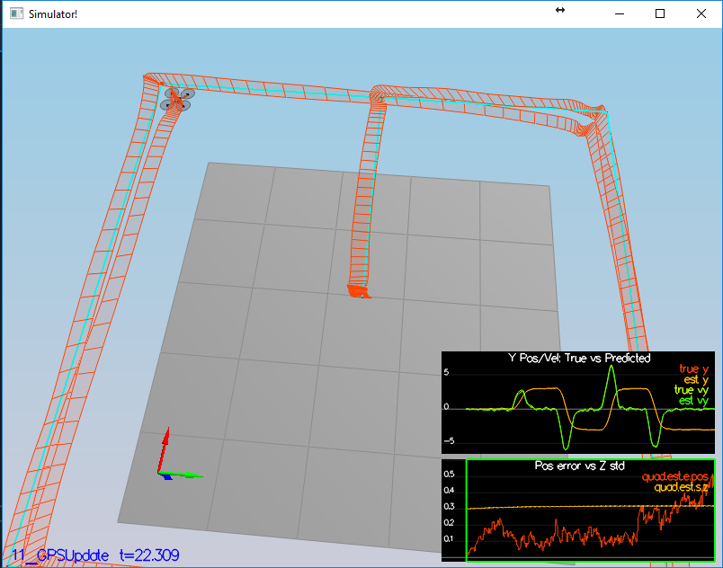
<br/>Flight Test V4

After working to tune the parameters, I was able to achieve a reasonable level of accuracy with my flight.

Upon completion, I received the following feedback:

```
Simulation #247 (../config/11_GPSUpdate.txt)
PASS: ABS(Quad.Est.E.Pos) was less than 1.000000 for at least 20.000000 seconds
```

<br/>

### References

[1] Stephanie Tellex, Andy Brown, Sergei Lupashin. Estimation for Quadrotors. Accessed January 26, 2019. https://www.overleaf.com/read/vymfngphcccj.